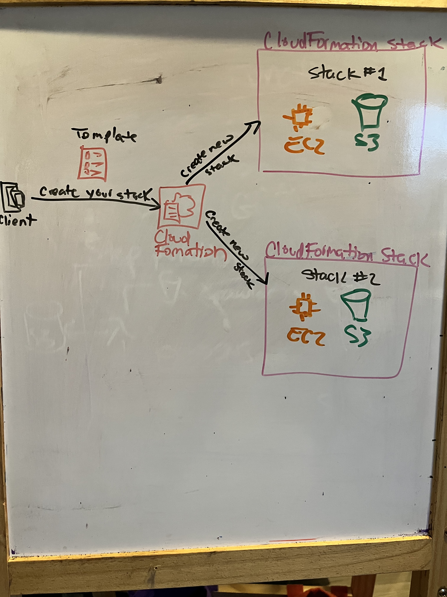
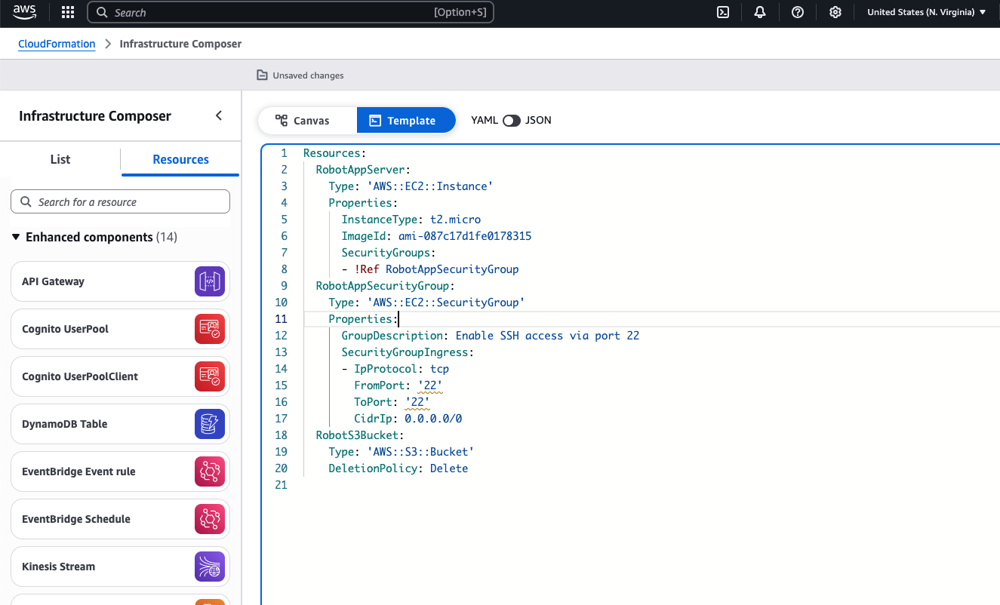

# AWS Automation with CloudFormation

Manual configuration can be fraught with configuration errors and misaligned developer environments, wasting a bunch of time. We can use AWS CloudFormation to define infrastructure as code.
A standard CloudFormation template can be created and deployed. CloudFormation can also automate network and security requirements.
Any service that is defined in AWS uses API calls, and a CloudFormation stack can handle it.

So the Solution Request here is to create an AWS CloudFormation stack from sample code. After the stack is created, use it to deploy specified resources.

  

## Table of Contents

- [Requirements](#requirements)
- [Steps](#Steps)
- [Conclusion](#conclusion)
- [Contributors](#contributors)

## Requirements
To complete this, you will need an AWS account with access to the following services:
- Amazon CloudFormation

##  Step 1: AWS CloudFormation helps you model a collection of resources, provision them quickly and consistently, and manage them throughout their lifecycles by treating infrastructure as code.

##  Step 2: This solution uses CloudFormation to create resources, called stacks. The definitions for the resources to be created are listed in a file, called a CloudFormation template.

  

##  Step 3: The template for this solution defines two main AWS resources: an instance in Amazon Elastic Compute Cloud (Amazon EC2) and a bucket in Amazon Simple Storage Service (Amazon S3).

## Step 4: Based on the template, CloudFormation determines the correct operations to perform, provisions resources in teh most efficient way possible, and automatically rolls back changes if errors are encountered.

## Step 5: CloudFormation treats infrastructure as code, which is an efficient way to model resources, provision them quickly and consistently, and manage them throughout their lifecycles.
