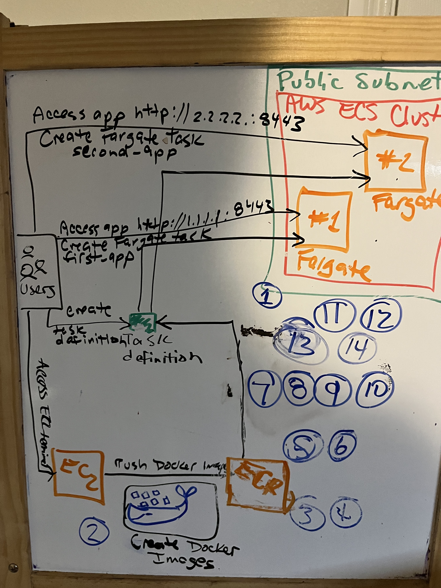
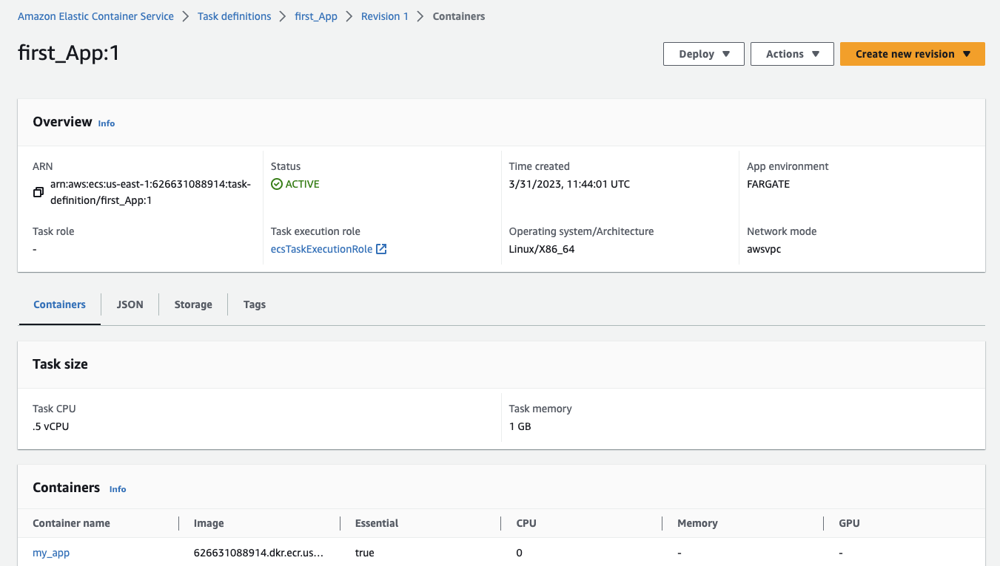

# Container Services

[](https://docs.aws.amazon.com/quicksight/latest/user/signing-up.html)
[](https://aws.amazon.com/ecs/)
[](https://aws.amazon.com/ecr/)
[](https://aws.amazon.com/fargate/)
[](https://aws.amazon.com/cloud9/)

So here is a solution to a hypothetical scenario where perhaps the city's premier medical research center wants to containerize and deploy their application in the cloud.

<p align="center">
  
</p>

## Table of Contents

- [Requirements](#requirements)
- [Steps](#Steps)
- [Conclusion](#conclusion)

## Requirements

To complete this solution, I utilized the following services

- Amazon ECR
- Amazon ECS
- Amazon Fargate
- Amazon Cloud9

## Steps

### Step 1. This solution uses Amazon Elastic Container Registry (Amazon ECR), Amazon Elastic COntainer Service (Amazon ECS), and AWS Fargate to host containerized applications without the need to provision and manage servers :

- Create an Amazon SQS queue
- Create an Amazon SNS topic
- Subscribe the Amazon SQS queue to the Amazon SNS topic
- Create an additional SQS queue and subscribe it to your existing SNS topic

### Step 2. I used the AWS EC2 terminal to create a Docker image of the clients application

### Step 3. To create a Docker image, I had to create a file called `Dockerfile`. A `Dockerfile` is a manifest that describes the base image to use for Docker image and what we want to install and run on it.

### Step 4. I used the "docker build" command to build Docker images from a `Dockerfile` and a context. A build's context is teh set of files for the containerized application located in a specified path or URL.

```bash
cd ~/environment/first_app
docker build  -t ${repo_name} .
```

### Step 5. Amazon ECR is an AWS managed container image registry service that is secure, scalable, and reliable. With it I can store, share, and deploy container software anywhere.

### Step 6. After the Docker image was created, I pushed the container to an Amazon ECR repository.

### Step 7. A task definition is required to run Docker containers in Amazon ECS. A task definition specifies parameters (such as CPU and memory) to use with each task, launch type, networking mode, logging configuration, run command, data volume, and IAM role that the task uses.

<p align="center">
  
</p>

### Step 8. Amazon ECS is a highly scalable Docker container management service that helps you run and manage distributed applications that run in Docker containers.

### Step 9. An Amazon ECS cluster is a logical grouping of tasks or services running on Amazon Elastic Compute Cloud (Amazon EC2) instances. A task is the instantiation of a task definition within a cluster. This is good for maintaining a desired number of tasks simultaneously.

### Step 10. AWS Fargate is a technology that can be used with Amazon ECS to run containers without having to manage servers or clusters of EC2 instances.

### Step 11. Fargate is a quick way to launch and run containers on AWS. Customers that want greater control of their EC2 instances (to support compliance and governance requirements or broader customization options) can choose to use Amazon ECS without Fargate.

### Step 12. Amazon ECS uses containers provisioned by Fargate to automatically scale, load balance, and manage scheduling of your containers for availability, providing a streamlined way to build and operate containerized applications.

### Step 13. I can run Amazon ECS tasks on Fargate to deploy and access containerized applications.

### Step 14. To deploy and access additional containerized applications, I would create a new Docker image, create a task definition, and run a new task in the Amazon ECS cluster.

## Conclusion

The skills I have obtained from developoing such an architecture can be applied to a wide variety of use cases, from simple message queuing systems to complex distributed applications. Let's talk about how I can create efficient and reliable applications that can adapt to changing business needs and user demands.

[](https://github.com/ldco206)
[](https://www.linkedin.com/in/daniel-cortes-a6051a175/)

